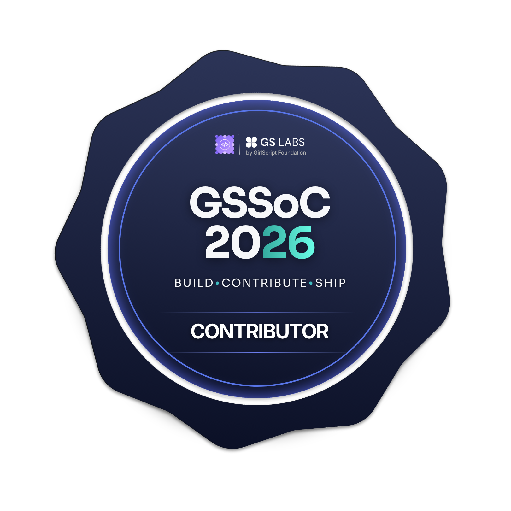

# Hi, I'm Samarth Sharma 👋

  
  

🎓 B.Tech CSE Student at KR Mangalam University (2025–29)  
💻 Full Stack Developer  
🚀 GSSoC 2026 Contributor  
🌱 Learning and building projects in tech
## 💻 Skills

### Programming Languages

  

### Frontend

  

### Database

  

### Backend

  

**API Integration**

### Tools

  

### Soft Skills
UI/UX

## 🏆 Achievements
- 🚀 GSSoC 2026 Contributor (Open Source Track)
- 🥈 Hackathon Runner-Up — Build & Beyond @ Tech Nexus, KRMU

## Connect with me
🔗 LinkedIn: [Samarth Sharma](https://www.linkedin.com/in/samarth-sharma-03567936a)
